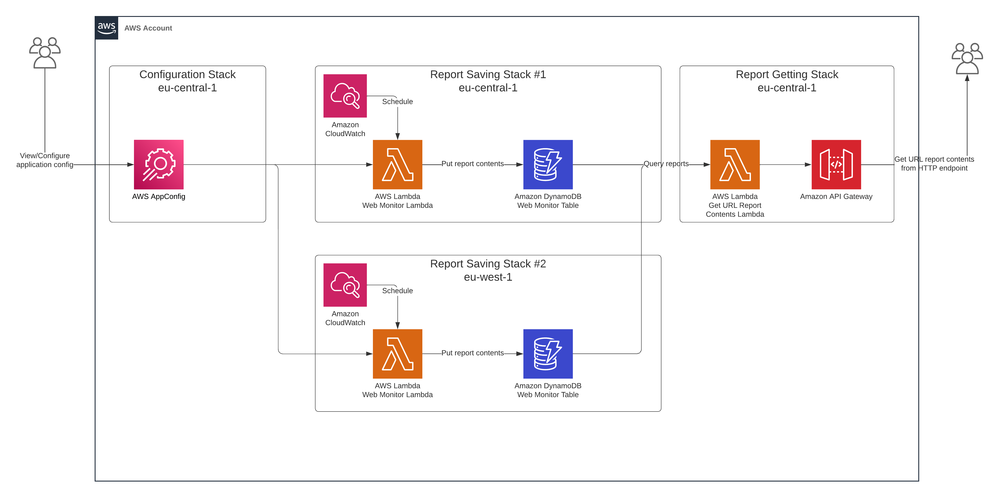

# WebMonitor

## What is WebMonitor

WebMonitor is a microservice backend system that periodically monitors websites
and reporting their availability.
It can assist website administrators in monitoring their sites
and promptly identify potential problems.

What it does:

- Read a list of URLs and their content requirements from the configuration.
- Periodically makes a GET Request to each URL.
- Check if the response content passes the requirements.
- Measure the elapsed time it takes for the website to respond.
- Store monitoring reports in databases.
- Expose a user-friendly HTTP endpoint to get these monitoring reports.

Its features:

- Users can view and modify application configuration with AWS AppConfig.
  AWS AppConfig will **validate configuration content** to match a JSON schema
  before deployment.
- Monitoring activities take place from **more than one**
  geographically distributed location simultaneously.
- Developers can set **checking period** and **checking locations**.

## How does WebMonitor work

### Architecture

This section describes the high-level architecture of WebMonitor on AWS Cloud.



There are three different stack classes:

- ConfigurationStack: allows users to specify which websites to monitor and
  which content rules the system needs to check.
  It uses AWS AppConfig to host the configuration.

- ReportSavingStack: periodically sends GET requests to a list of websites,
  analyzes their response contents to check if they satisfy predefined rules,
  and put monitoring reports into DynamoDB Table.
  It consists of one AWS Lambda scheduled by Cloudwatch Event and one DynamoDB table.

- ReportGettingStack: exposes a GET Endpoint for users to query reports stored in
  DynamoDB Tables in different regions.
  It consists of one AWS Lambda and one API Gateway Rest API.

## Getting started

### Usage

#### Configuration (for users)

This section shows how can you view and modify application configuration
(which consists of `url`s and `rules`) with AWS AppConfig.

- Log in with IAM user name: `web-monitor-user` to AWS Account.
  (Contact me for account alias and password)
- Follow this guide to deploy a configuration on AWS AppConfig:

  [set-configuration-web-monitor.webm](https://github.com/anhtumai/webapp-monitor/assets/32799668/6d5355da-1b7b-4e22-921e-d07654a2781c)

Here is the configuration JSON Schema:

```json
{
  "type": "array",
  "items": {
    "type": "object",
    "required": ["url", "rules"],
    "additionalProperties": false,
    "properties": {
      "url": { "type": "string" },
      "rules": {
        "type": "array",
        "items": {
          "type": "object",
          "properties": {
            "containText": { "type": "string" }
          }
        }
      }
    }
  }
}
```

Sample configuration:

```json
[
  {
    "url": "https://cnn.com",
    "rules": [
      {
        "containText": "Entertainment"
      },
      {
        "containText": "Login"
      },
      {
        "otherRule": {
          "param1": "random",
          "param2": "random"
        }
      }
    ]
  }
]
```

#### Getting report contents

Send a GET request to query report contents for a specific url and checking region

Example:

```bash
curl -G $WEB_MONITOR_ENDPOINT \
       -d url=https://cnn.com \
       -d region=eu-central-1 \
       -d limit=1 \
       -d start=2023-05-01T00:00:00.000Z \
       -d end=2023-05-30T00:00:00.000Z \
```

**Note**: Please contact me to get $WEB_MONITOR_ENDPOINT

Query params:

- url (string): website link (exp: `https://cnn.com`)
- region (string): checking region that web monitoring starts from.
  Supported regions: `eu-central-1`, `eu-west-1`
- limit (number): the maximum number of report content items you want to get
- start (string) (optional): start time in ISO 8601 datetime format (exp: 2023-05-01T00:00:00.000Z).
- end (string) (optional): end time in ISO 8601 datetime format (exp: 2023-05-01T00:00:00.000Z).
  Response contains all report contents taking place between
  `start` (inclusive) and `end` (inclusive).

Sample Response:

```json
{
  "items": [
    {
      "time": "2023-05-14T16:04:43.226Z",
      "reportContent": {
        "elapsedDurationInMs": 1118,
        "startTime": "2023-05-14T16:04:43.226Z",
        "rulesEvaluation": [
          {
            "rule": {
              "containText": "Enter"
            },
            "knownRule": true,
            "passed": true
          },
          {
            "rule": {
              "containText": "Login"
            },
            "knownRule": true,
            "passed": false
          },
          {
            "rule": {
              "unknownRule": 1
            },
            "knownRule": false,
            "passed": false
          }
        ],
        "url": "https://cnn.com",
        "statusCode": 200
      },
      "url": "https://cnn.com"
    }
  ]
}
```

### Deployment

Deploying this software on your AWS Account requires these tools:

**Prerequisites**

- NodeJs runtime, version 16+
- Yarn package manager
- Docker

Inintialize and install project dependencies:

```bash
yarn install

# or

npm install
```

Bootstrap CDK on all deployed environments:

```bash
yarn cdk bootsrap
```

Deploy project:

```bash
yarn cdk deploy --all
```

**Note**: After deploying project, we also need to deploy a configuration
(as instruction in [Configuration (for users)](#Configuration "for users")
Otherwise, Web Monitor Lambda cannot run.

### Configuration (for developers)

Developers can configure `checking period` and `checking regions` in file: `./lib/config.ts`.

### Destroying

Delete all hosted configurations in AWS AppConfig: `web-monitor-app-config-app`

Run CDK destroy command:

```bash
yarn cdk destroy --all
```
